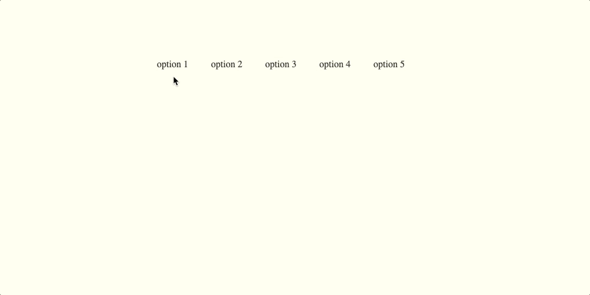
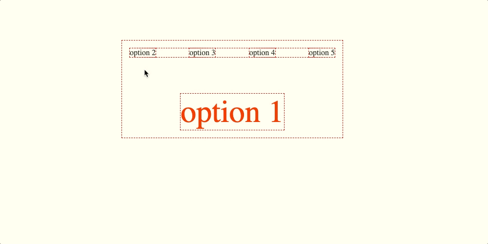

Svelte has amazing animation and transition capabilities out of the box,
but if you've ever tried to make several elements transition in and out of the same designated spot,
you've probably encountered what I call "the jump problem" (yup, I'm very creative with names).

I've experienced it first when I built my [personal website](https://itamarga.com).

In the post I'll reproduce this problem and demonstrate how it can be fixed.

## Step 1: Our Example App

We'll begin with a simple app that has several selectable options,
of which only zero or one can be selected at any given time:

```html
<script>
  export let options = [
    {name: "option 1", isSelected: false},
    {name: "option 2", isSelected: false},
    {name: "option 3", isSelected: false},
    {name: "option 4", isSelected: false},
    {name: "option 5", isSelected: false},
  ];

  const select = (name) => {
    options = options.map(option => ({...option, isSelected: option.name === name}));
  }

  $: availableOptions = options.filter(option => !option.isSelected);
  $: selectedOption = options.filter(option => option.isSelected);
</script>

<main>
  <ul>
    {#each availableOptions as { name } (name)}
      <li on:click={() => select(name)}>
        {name}
      </li>
    {/each}
  </ul>

  <h1>{selectedOption?.name || ""}</h1>
</main>

<style>
  main {
    text-align: center;
    padding: 1em;
    max-width: 420px;
    margin: 0 auto;
  }

  h1 {
    color: #ff3e00;
    font-size: 4em;
    font-weight: 100;
    display: inline-block;
    margin: 0;
    padding: 0;
  }

  ul {
    display: flex;
    list-style: none;
    justify-content: space-between;
    padding: 0;
    margin: 0 0 75px 0;
  }

  ul li {
    cursor: pointer;
  }
</style>
```

Here's how it looks:



Nice.

The first thing we'll do is take this line:

```html
<h1>{selectedOption?.name || ""}</h1>
```

And change it into this:

```html
{#each selectedOption as {name} (name)}
  <h1>{name || ""}</h1>
{/each}
```

The app should look the same, but under the hood, we're sort of fooling Svelte into allowing us to use
[deferred transitions](https://svelte.dev/tutorial/deferred-transitions) outside of their typical use case.

## Step 2: Adding the Transitions

Now, the fun part.

We'll add these 3 imports:

```js
import { flip } from 'svelte/animate';
import { crossfade } from 'svelte/transition';
import { cubicOut } from 'svelte/easing';
```

We'll also prepare our `send` and `receive` transitions:

```js
const DEFAULT_DURATION = 500;

const [send, receive] = crossfade({duration: DEFAULT_DURATION, easing: cubicOut});
```

Then, we'll add the transitions to elements in our template:

<small><small>(I'm using `name` as a `key` 'cause it's just a dirty, dirty example)</small></small>

```html
<main>
  <ul>
    {#each availableOptions as { name } (name)}
    <li
      on:click={() => select(name)}
      in:receive="{{key: name}}"
      out:send="{{key: name}}"
      animate:flip="{{duration: DEFAULT_DURATION}}"
    >
      {name}
    </li>
    {/each}
  </ul>

  {#each selectedOption as { name } (name)}
    <h1
      in:receive="{{key: name}}"
      out:send="{{key: name}}"
    >
      {name || ""}
    </h1>
  {/each}
</main>
```

And there it is - the problem we're looking for!


See that little jump right after the transition ends? Do you feel the pain?

Alright, let's make the world better by making this jump go away.

First we're gonna outline every existing element on the page so we can see more clearly what's happening here:

```css
* {
  outline: 1px red dashed;
}
```



The element that goes into the spot positions itself right under the one that's currently in the spot.
After the transition ends, the one that's going back to the list ceases to take up that space,
causing the one we sent in to jump up.

Which at last brings us to the important part...

## Step 3: Fixing the Jump

We basically need to enable this spot to hold elements on top of each other.

There are several approaches we can take here, the most obvious one being `position: absolute;` on the `h1`.

In an app as simple as this, I'd go for it. But in real world apps that are often more complex,
this approach might require using JavaScript to calculate the spot's
location and dimensions - which doesn't make things simpler.

We are too lazy for that.

We'll use a CSS Grid hack that makes it possible to place several elements
on the same spot while keeping the default static positioning.

Let's wrap our selected item in a `div`:

```html
<div class="selected-item-slot">
  <!-- #each block with h1 in it -->
</div>
```

Then we'll make it a `grid` (with `place-items: center;` so that items inside don't stretch)

```css
.selected-item-slot {
  display: grid;
  place-items: center;
}
```

Lastly, tell our `h1` to always take up the same row and column:

```css
grid-row: 1;
grid-column: 1;
```


It's ready - Bon appétit!

---
<br>

Here's a [repo](https://github.com/pitamer/Svelte-transitions-blog-post) with the whole code and process :)
